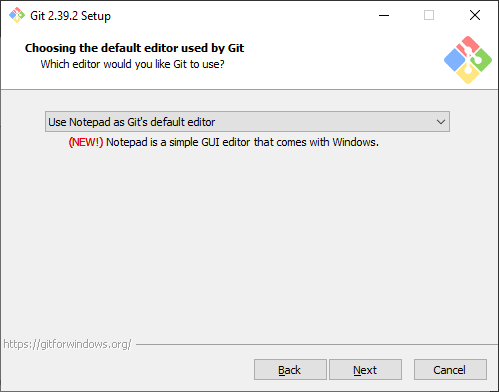
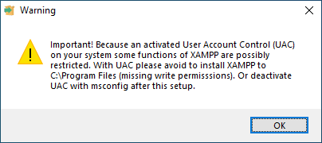
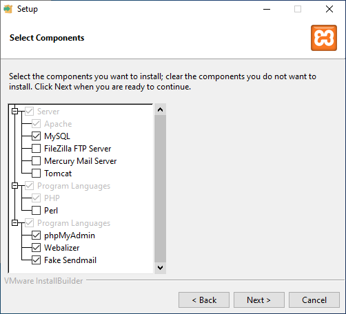
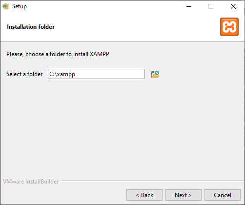
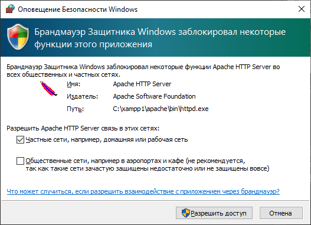
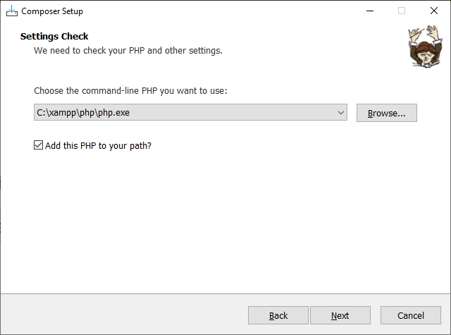
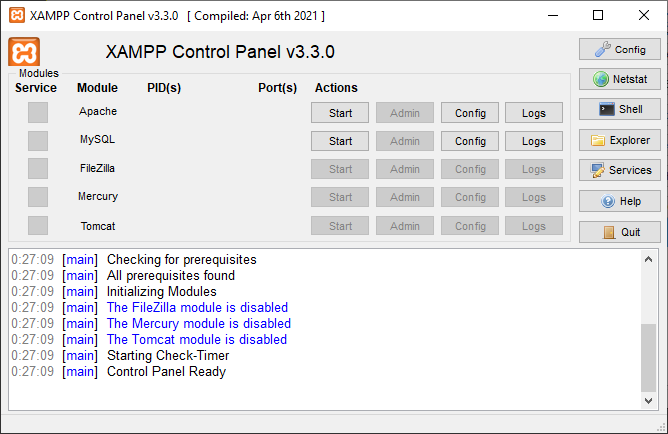
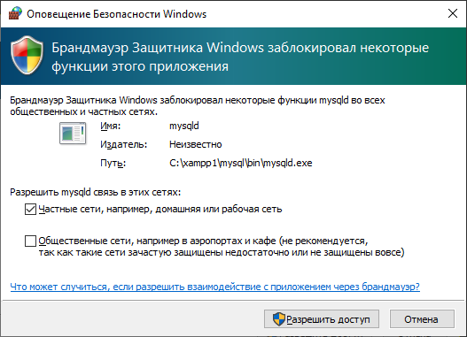
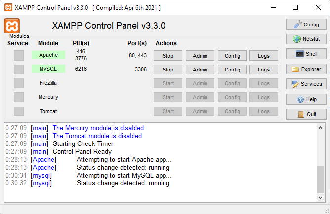

# Инструкция по установке ПО для веб­‑разработки

Предназначена для аудитории 310 в здании № 2 (Нахимовский пр‑т).

## Установка <i lang="en">Git</i>

1. Скачайте самый свежий автономный 64­‑битный установщик (<i lang="en">standalone installer</i>, не <i lang="en">portable</i>!) с веб­‑страницы <https://git-scm.com/download/win>.

2. Запустите установщик.

3. На экране № 5 из выпадающего списка выберите пункт <i lang="en">Use Notepad as Git’s default editor</i>.

    

4. На остальных экранах оставьте настройки по умолчанию.

## Установка <i lang="en">XAMPP</i>

1. Скачайте дистрибутив <i lang="en">XAMPP</i> 8.2.0 ([ссылка](https://sourceforge.net/projects/xampp/files/XAMPP%20Windows/8.2.0/xampp-windows-x64-8.2.0-0-VS16-installer.exe)).

2. Запустите установщик.

3. Если включён <i lang="en">User account control (UAC)</i>, то <i lang="en">XAMPP</i> нельзя устанавливать в каталог <code lang="en">Program Files</code>.

    

4. На экране № 2 установите галочки

    - <i lang="en">Apache</i>,
    - <i lang="en">MySQL</i>,
    - <i lang="en">PHP</i>,
    - <i lang="en">phpMyAdmin</i>,
    - <i lang="en">Webalizer</i>,
    - <i lang="en">Fake Sendmail</i>.

    Остальные галочки можно снять:

    - <i lang="en">FileZilla FTP Server</i>,
    - <i lang="en">Mercury Mail Server</i>,
    - <i lang="en">Tomcat</i>,
    - <i lang="en">Perl</i>.
    
    

5. На экране № 3 необходимо указать такой путь для установки, который

    - позволит студентам беспрепятственно манипулировать как минимум содержимым каталога <code lang="en">xampp\htdocs</code> и, по возможности, редактировать файл <code lang="en">xampp\apache\conf\extra\httpd-vhosts.conf</code>;
    - не содержит пробелов.

    Желательно, чтобы конечный элемент пути указывал на пустой <code lang="en">xampp</code>.

    

    В настоящей инструкции будет использован путь <code lang="en">C:\xampp</code>.

6. На остальных экранах оставьте настройки по умолчанию.

7. Если откроется окно с оповещением от брандмауэра <i lang="en">Windows</i>, то

    - установите галочку «Частные сети...»;
    - снимите галочку «Общественные сети...»;
    - нажмите на кнопку «Разрешить доступ».

    

## Установка <i lang="en">Composer</i>

1. Скачайте дистрибутив <i lang="en">Composer</i>: <https://getcomposer.org/Composer-Setup.exe>.

2. Запустите установщик. Для установки необходим доступ в Интернет!

3. На экране № 2

    - нажмите на кнопку <i lang="en">Browse...</i> и укажите абсолютный путь до исполняемого файла <i lang="en">php.exe</i>, который размещён в каталоге <code lang="en">xampp\php</code>. Например, если <i lang="en">XAMPP</i>, то путь должен выглядеть так: <code lang="en">C:\xampp\php\php.exe</code>;
    - установите галочку «<i lang="en">Add this PHP to your path?</i>»;
    - нажмите на кнопку «<i lang="en">Next</i>».

    

4. На остальных экранах оставьте настройки по умолчанию.

## Настройка <i lang="en">XAMPP</i>

1. Удалите 

    - каталог <code lang="en">xampp\php\pear\PHPUnit2</code>;
    - каталог <code lang="en">xampp\php\pear\PHPUnit</code>;
    - файл <code lang="en">xampp\php\pear\PHPUnit.php</code>;
    - файл <code lang="en">xampp\php\phpunit.bat</code>;
    - файл <code lang="en">xampp\php\phpunit</code>.

2. Откройте на редактирование файл конфигурации <i lang="en">xampp\php\php.ini</i>, найдите в нём директивы

    ```ini
    error_reporting=E_ALL & ~E_DEPRECATED & ~E_STRICT
    ;extension=gd
    ;extension=intl
    ;extension=zip
    ```

    и замените их соответственно на

    ```ini
    error_reporting = E_ALL
    extension=gd
    extension=intl
    extension=zip
    ```

    Сохраните изменения в файле.

3. Запустите <i lang="en">XAMPP Control Panel</i>. Если она была запущена ранее, то её необходимо остановить, нажав на кнопку <i lang="en">Quit</i>, и запустить повторно.

    

4. Нажать на кнопку <i lang="en">Start</i>, расположенную напротив <i lang="en">Apache</i>.

5. Если откроется окно с оповещением от брандмауэра <i lang="en">Windows</i>, то

    - установите галочку «Частные сети...»;
    - снимите галочку «Общественные сети...»;
    - нажмите на кнопку «Разрешить доступ».

    

6. Нажать на кнопку <i lang="en">Start</i>, расположенную напротив <i lang="en">MySQL</i>.

7. Если откроется окно с оповещением от брандмауэра <i lang="en">Windows</i>, то

    - установите галочку «Частные сети...»;
    - снимите галочку «Общественные сети...»;
    - нажмите на кнопку «Разрешить доступ».

    

8. Убедитесь, что сервера запущены.

    

9. Нажмите на кнопку <i lang="en">Shell</i>. Будет открыт эмулятор терминала.

10. Подайте команду

    ```batch
    git -v
    ```

    Должен быть выведен номер установленной версии <i lang="en">Git</i> (`2.39` или выше).

11. Подайте команду

    ```batch
    php -v
    ```

    Должен быть выведен номер установленной версии <i lang="en">PHP</i> (`8.2.0` или выше).

12. Подайте команду

    ```batch
    mysql -u root -p
    ```

    В ответ на предложение ввести пароль <i lang="en">(Enter password)</i> ещё раз нажмите на клавишу <kbd>Enter</kbd>. Должно быть выведено приглашение ко вводу команд:

    ```batch
    MariaDB [(none)]>
    ```

    Для выхода из клиента введите:

    ```batch
    EXIT
    ```

13. Подайте команду

    ```batch
    composer -V
    ```

    Обратите внимание, в отличие от предыдущих команд здесь используется заглавная буква <i lang="en">V</i>.

    Должен быть выведен номер установленной версии <i lang="en">Composer</i> (`2.5` или выше).

14. Подайте команду на установку каркаса программной системы <i lang="en">Laravel</i>:

    ```batch
    composer global require --dev laravel/installer
    laravel -V
    ```

    Должен быть выведен номер установленной версии <i lang="en">Laravel</i> (`4.4` или выше).

15. Подайте команду на установку средства тестирования <i lang="en">PHPUnit</i>:

    ```batch
    composer global require --dev phpunit/phpunit
    phpunit --version
    ```

    Должен быть выведен номер установленной версии <i lang="en">PHPUnit</i> (`10` или выше).

16. В каталоге <code lang="en">xampp\htdocs</code> создать каталог <code lang="en">example</code>, а в нём — текстовый документ <code lang="en"></code> следующего содержания:

    ```html
    <!DOCTYPE html>
    <html lang="ru-luna1918">
    <head>
      <meta charset="UTF-8">
      <title>Привет, мир!</title>
    </head>
    <body>
      <h1>Привет, мир!</h1>
    </body>
    </html>
    ```

17. Запустить браузер и обратиться по адресу: <http://localhost/example/index.html>. Должна быть выведена веб­‑страница с заголовком «Привет, мир!».
